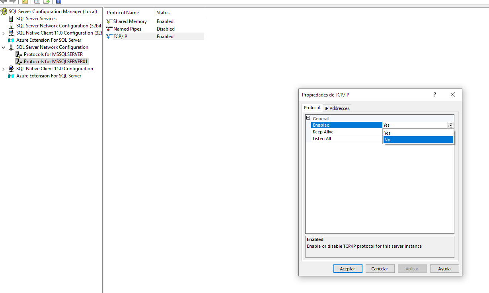

# CorreccionPruebaPOO

## Realizado por: Eduardo ALmachi

### Corrección de la prueba y SQL Server
En grupo realizar la correccion de la prueba, con la única modificación de conectar con Microsoft SQL Server.

Entregable: repositorio de github explicativo con capturas.

- Configuracion de BD MYSQL

